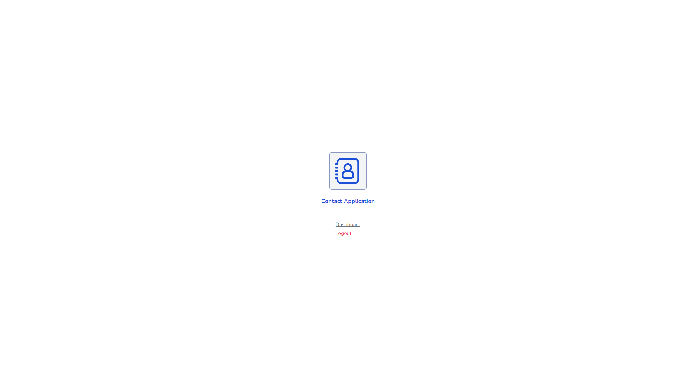
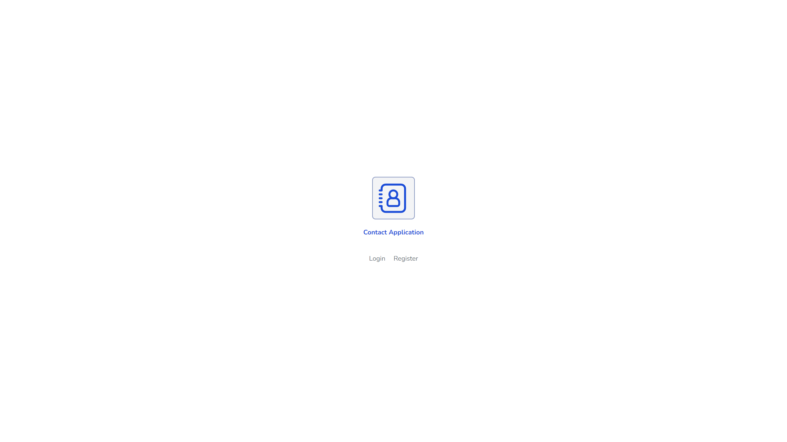
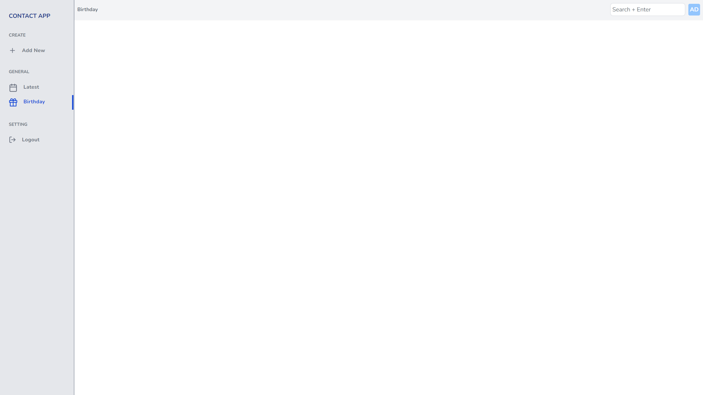
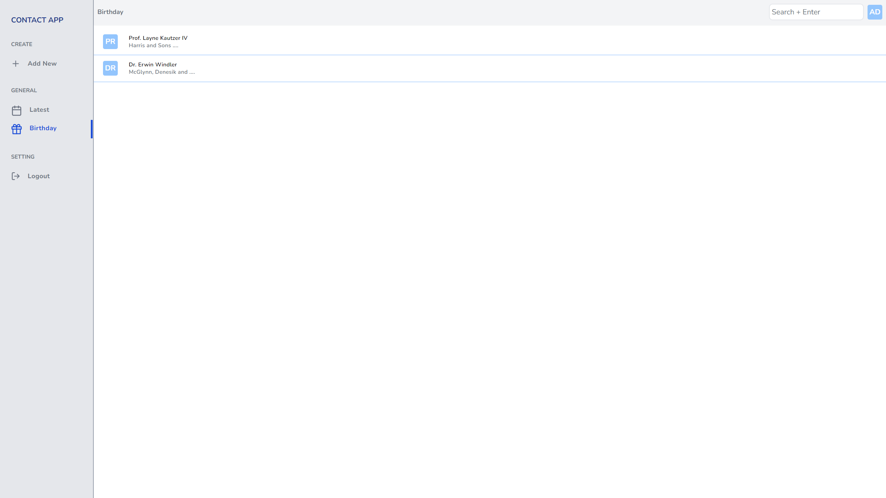
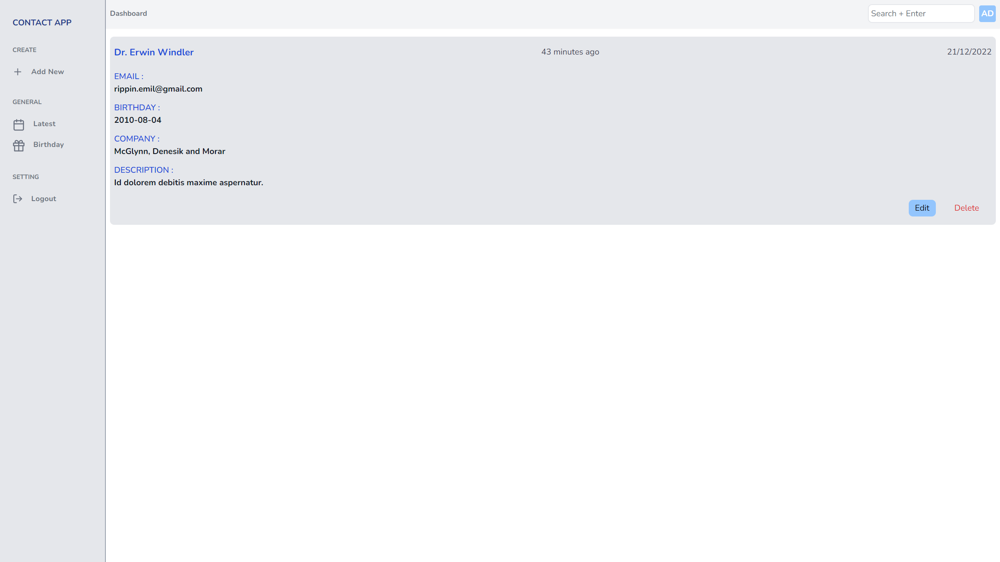
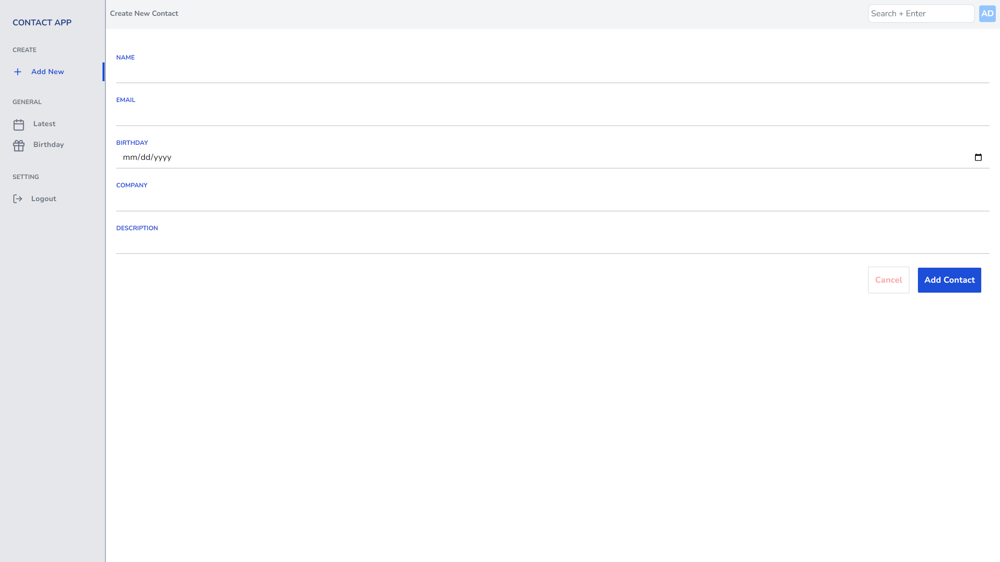
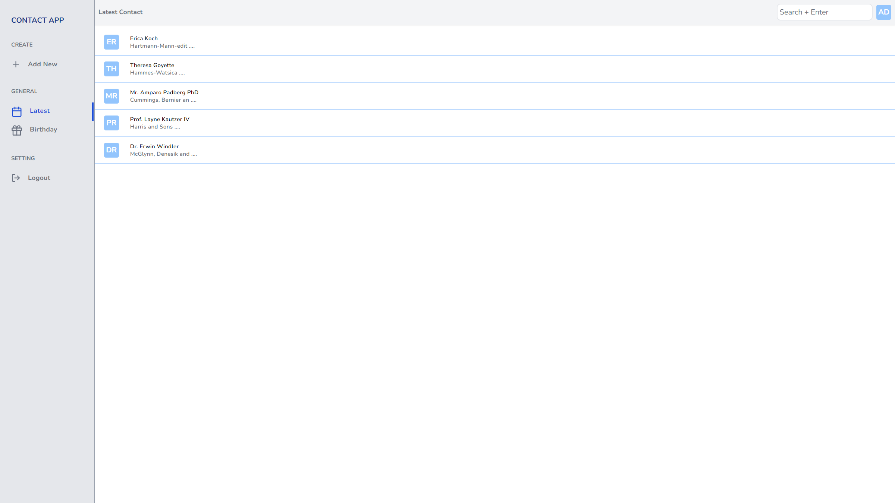
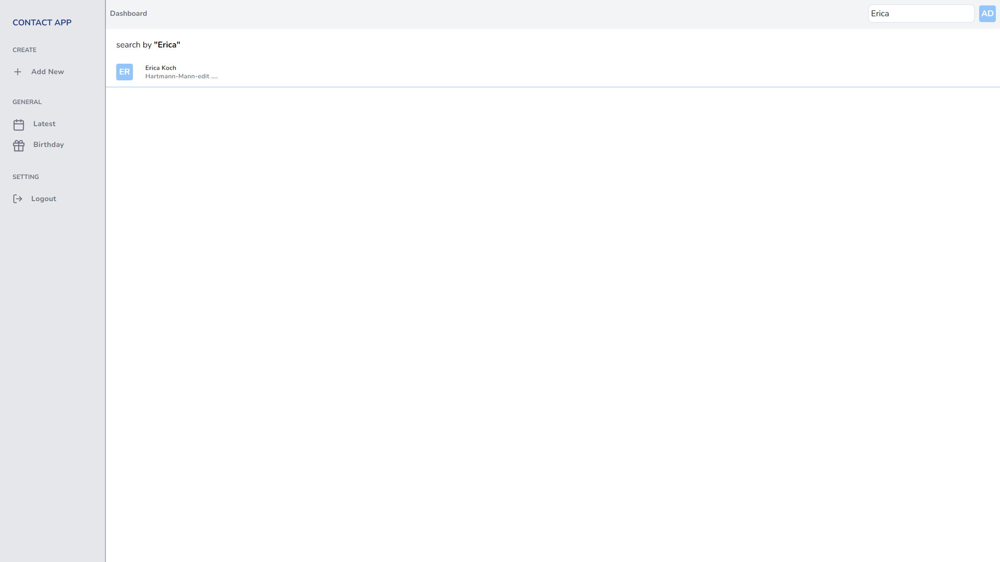

Contact APP

### Uses

##### Frontend
- Mainly TailwindCSS,
##### Backend
- Mainly Laravel Framework

####Features

- Basic CRUD Operation

**Welcome Page**

---

**Login Page**

---

**Birthday Page**

---

**Detail Page**

---

**Create Contact Page**

---

**Contact List**

---

**Search Page**

---
